* Table of Contents
{:toc}

--------------------------------------------------------------------------------------------------------------------

## **Acknowledgements**

* {list here sources of all reused/adapted ideas, code, documentation, and third-party libraries -- include links to the original source as well}

--------------------------------------------------------------------------------------------------------------------

## **Setting up, getting started**

Refer to the guide [_Setting up and getting started_](SettingUp.md).

--------------------------------------------------------------------------------------------------------------------

## **Design**

:bulb: **Tip:** The `.puml` files used to create diagrams in this document can be found in the [diagrams](https://github.com/se-edu/AY2122S2-CS2103T-T13-2/tree/master/docs/diagrams/) folder. Refer to the [_PlantUML Tutorial_ at se-edu/guides](https://se-education.org/guides/tutorials/plantUml.html) to learn how to create and edit diagrams.

### Architecture

The ***Architecture Diagram*** given above explains the high-level design of the App.

Given below is a quick overview of main components and how they interact with each other.

**Main components of the architecture**

**`Main`** has two classes called [`Main`](https://github.com/se-edu/AY2122S2-CS2103T-T13-2/tree/master/src/main/java/seedu/address/Main.java) and [`MainApp`](https://github.com/se-edu/AY2122S2-CS2103T-T13-2/tree/master/src/main/java/seedu/address/MainApp.java). It is responsible for,
* At app launch: Initializes the components in the correct sequence, and connects them up with each other.
* At shut down: Shuts down the components and invokes cleanup methods where necessary.

[**`Commons`**](#common-classes) represents a collection of classes used by multiple other components.

The rest of the App consists of four components.

* [**`UI`**](#ui-component): The UI of the App.
* [**`Logic`**](#logic-component): The command executor.
* [**`Model`**](#model-component): Holds the data of the App in memory.
* [**`Storage`**](#storage-component): Reads data from, and writes data to, the hard disk.

**How the architecture components interact with each other**

The *Sequence Diagram* below shows how the components interact with each other for the scenario where the user issues the command `delete class 2`.

Each of the four main components (also shown in the diagram above),

* defines its *API* in an `interface` with the same name as the Component.
* implements its functionality using a concrete `{Component Name}Manager` class (which follows the corresponding API `interface` mentioned in the previous point.

For example, the `Logic` component defines its API in the `Logic.java` interface and implements its functionality using the `LogicManager.java` class which follows the `Logic` interface. Other components interact with a given component through its interface rather than the concrete class (reason: to prevent outside component's being coupled to the implementation of a component), as illustrated in the (partial) class diagram below.

The sections below give more details of each component.

### UI component

The **API** of this component is specified in [`Ui.java`](https://github.com/se-edu/AY2122S2-CS2103T-T13-2/tree/master/src/main/java/seedu/address/ui/Ui.java)

The UI consists of a `MainWindow` that is made up of parts e.g.`CommandBox`, `ResultDisplay`, `EntityListPanel`*, `StatusBarFooter` etc. All these, including the `MainWindow`, inherit from the abstract `UiPart` class which captures the commonalities between classes that represent parts of the visible GUI.

*`EntityListPanel` and *`EntityListCard` represent separate list panels and cards tailored for a specific entity (`Student`, `ClassGroup`, `Module`, `Assessment`).

The `UI` component uses the JavaFx UI framework. The layout of these UI parts are defined in matching `.fxml` files that are in the `src/main/resources/view` folder. For example, the layout of the [`MainWindow`](https://github.com/se-edu/AY2122S2-CS2103T-T13-2/tree/master/src/main/java/seedu/address/ui/MainWindow.java) is specified in [`MainWindow.fxml`](https://github.com/se-edu/AY2122S2-CS2103T-T13-2/tree/master/src/main/resources/view/MainWindow.fxml)

The `UI` component,

* executes user commands using the `Logic` component.
* listens for changes to `Model` data so that the UI can be updated with the modified data.
* keeps a reference to the `Logic` component, because the `UI` relies on the `Logic` to execute commands.
* depends on some classes in the `Model` component, as it displays various `Entity` objects residing in the `Model`.

### Logic component

**API** : [`Logic.java`](https://github.com/AY2122S2-CS2103T-T13-2/tp/blob/master/src/main/java/seedu/address/logic/Logic.java)

Here's a (partial) class diagram of the `Logic` component:

How the `Logic` component works:
1. When `Logic` is called upon to execute a command, it uses the `TAssistParser` class to parse the user command.
1. This results in a `Command` object (more precisely, an object of one of its subclasses e.g., `AddCommand`) which is executed by the `LogicManager`.
1. The command can communicate with the `Model` when it is executed (e.g. to add a student).
1. The result of the command execution is encapsulated as a `CommandResult` object which is returned back from `Logic`.

The Sequence Diagram below illustrates the interactions within the `Logic` component for the `execute("delete class 2")` API call.

:information_source: **Note:** The lifeline for `DeleteCommandParser` should end at the destroy marker (X) but due to a limitation of PlantUML, the lifeline reaches the end of diagram.

Here are the other classes in `Logic` (omitted from the class diagram above) that are used for parsing a user command:

How the parsing works:
* When called upon to parse a user command, the `TAssistParser` class creates an `XYZCommandParser` (`XYZ` is a placeholder for the specific command name e.g., `AddCommandParser`) which uses the other classes shown above to parse the user command and create a `XYZCommand` object (e.g., `AddCommand`) which the `TAssistParser` returns back as a `Command` object.
* All `TAssistParser` classes (e.g., `AddCommandParser`, `DeleteCommandParser`, ...) inherit from the `Parser` interface so that they can be treated similarly where possible e.g, during testing.

### Model component
**API** : [`Model.java`](https://github.com/AY2122S2-CS2103T-T13-2/tp/blob/master/src/main/java/seedu/address/model/Model.java)

The `Model` component,

* stores the TAssist data i.e., all `Student`, `TaModule`, `ClassGroup`, `Assessment` objects (which are contained in `UniqueStudentList`, `UniqueModuleList`, `UniqueClassGroupList`, `UniqueAssessmentList` objects respectively).
* stores the currently 'selected' `Student`/`TaModule`/`ClassGroup`/`Assessment` objects (e.g., results of a search query) as a separate _filtered_ list which is exposed to outsiders as an unmodifiable `ObservableList<Student>`/`ObservableList<TaModule>`
/`ObservableList<ClassGroup>`/`ObservableList<Assessment>` that can be 'observed' e.g. the UI can be bound to this list so that the UI automatically updates when the data in the list change.
* stores a `UserPref` object that represents the user’s preferences. This is exposed to the outside as a `ReadOnlyUserPref` objects.
* does not depend on any of the other three components (as the `Model` represents data entities of the domain, they should make sense on their own without depending on other components).
* An `Entity` object is a generic object that can be used to represent instances of  `Student`/`TaModule`/`ClassGroup`/`Assessment`.
* Module are named `TaModule` due to conflict with Java classes.

:information_source: <B>Note:</B> Alternative (arguably, more OOP) models are given below. 
 

    <table class="c20">
        <tbody>
            <tr></tr>
            <tr class="c11">
                <td class="c16" colspan="1" rowspan="1">
                   <B>Entity</B>
                </td>
                <td class="c9" colspan="1" rowspan="1">
                   <B>Class Diagram</B>
                </td>
            </tr>
            <tr></tr>
            <tr class="c11">
                <td class="c16" colspan="1" rowspan="1">
                   Student
                </td>
                <td class="c9" colspan="1" rowspan="1">
                   
                </td>
            </tr>
            <tr></tr>
            <tr class="c11">
                <td class="c16" colspan="1" rowspan="1">
                   TaModule
                </td>
                <td class="c9" colspan="1" rowspan="1">
                   
                </td>
            </tr>
            <tr></tr>
            <tr class="c11">
                <td class="c16" colspan="1" rowspan="1">
                   Class Group
                </td>
                <td class="c9" colspan="1" rowspan="1">
                   
                </td>
            </tr>
            <tr></tr>
            <tr class="c11">
                <td class="c16" colspan="1" rowspan="1">
                   Assessment
                </td>
                <td class="c9" colspan="1" rowspan="1">
                   
                </td>
            </tr>
        </tbody>
    </table>

### Storage component

**API** : [`Storage.java`](https://github.com/AY2122S2-CS2103T-T13-2/tp/blob/master/src/main/java/seedu/address/storage/Storage.java)

The `Storage` component,
* can save both TAssist data and user preference data in json format, and read them back into corresponding objects.
* inherits from both `TAssistStorage` and `UserPrefStorage`, which means it can be treated as either one (if only the functionality of only one is needed).
* depends on some classes in the `Model` component (because the `Storage` component's job is to save/retrieve objects that belong to the `Model`)

### Common classes

Classes used by multiple components are in the `seedu.address.commons` package.

--------------------------------------------------------------------------------------------------------------------

## **Implementation**

This section describes some noteworthy details on how certain features are implemented.

###  Add Feature

The add mechanism is facilitated by `TAssist`. Its functionality, usage and behaviour is the same for all entities. Additionally, it implements the following operations:

* `AddCommandParser#parse()` — Parses the command arguments.
* `AddCommand#execute()` — Executes `ModelManager#addEntity()` with the specified entity.
* `ModelManager#addEntity()` — Adds the specified entity.

Given below is an example usage scenario for the creation of `Student` object and how the add mechanism behaves at each step.

:information_source: **Note:** As TAssist comes with initial data, the user should issue a `clear` command to remove all existing data.

Step 1. The user launches the application. The `TAssist` is already populated with data.

Step 2. The user executes `clear` command to remove all existing data in `TAssist`.

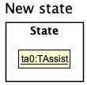

Step 3. The user executes `add student` command to add a student to `TAssist`. The `add` command also calls `AddCommandParser#parse()`, which parses the input and returns the index and entity type.
* An example of the `add student` command: `add student id/E0123456 n/John Doe e/johnd@example.com t/john_doe`

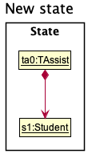

:information_source: **Note:** If a command fails its execution, it will not call `AddCommand#execute()`, instead a `CommandException` will be thrown and no entity will be added.

The following sequence diagram shows how the add operation works:

:information_source: **Note:** The lifeline for `AddCommand` should end at the destroy marker (X) but due to a limitation of PlantUML, the lifeline reaches the end of diagram.

The following activity diagram summarizes what happens when a user executes an add command:

### Delete Feature

The delete mechanism is facilitated by `TAssist`. Its functionality, usage and behaviour is the same for all entities. Additionally, it implements the following operations:

* `DeleteCommandParser#parse()` — Parses the command arguments.
* `DeleteCommand#execute()` — Executes `ModelManager#deleteEntity()` with the specified entity.
* `ModelManager#deleteEntity()` — Deletes the specified entity.

However, when a `TaModule` object is deleted, its associated `ClassGroup` and `Assessment` object(s) are also deleted.

Given below is an example usage scenario using `ClassGroup` objects and how the delete mechanism behaves at each step.

Step 1. The user launches the application. The `TAssist` is already populated with data.

Step 2. The user executes `list class` command to list the class groups in the `TAssist`. The `list` command implementation is detailed below in the List Feature section.

Step 3. The user executes `delete class 2` to delete the 2nd class group in the list which is `c2`. The `delete` command also calls `DeleteCommandParser#parse()`, which parses the input and return the index and entity type.

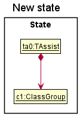

:information_source: **Note:** If a command fails its execution, it will not call `DeleteCommand#execute()`, instead a `CommandException` will be thrown and no entities will be deleted.

The following sequence diagram shows how the delete operation works:

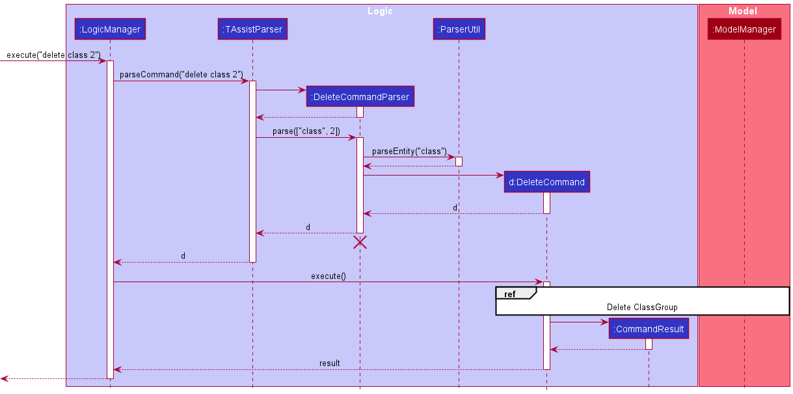

:information_source: **Note:** The lifeline for `DeleteCommand` should end at the destroy marker (X) but due to a limitation of PlantUML, the lifeline reaches the end of diagram.

The following activity diagram summarizes what happens when a user executes a delete command:

### List Feature

The list mechanism is facilitated by `TAssist`. Its functionality, usage and behaviour is the same for all entities. Additionally, it implements the following operations:

* `ListCommandParser#parse()` — Parses the command arguments.
* `ListCommand#execute()` — Executes `ModelManager#updateFiltered<ENTITY_NAME>List()` with the predicate that matches the filtering criteria.
* `ModelManager#updateFiltered<ENTITY_NAME>List()` — Updates the predicate of the entity list so that only filtered entries will be shown in `TAssist`.

Given below is an example usage scenario using `Student` objects and how the list mechanism behaves at each step.

Step 1. The user launches the application. The `TAssist` is already populated with data.

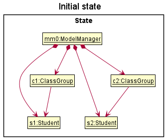

Step 2. The user executes `list student c/2` to filter out students from the 2nd class group in the list. The `list` command also calls `ListCommandParser#parse()`, which parses the input and return the entity type as well as the class group index or TA module index to filter by.

The following sequence diagram shows how the list operation works:

:information_source: **Note:** The lifeline for `ListCommand` should end at the destroy marker (X) but due to a limitation of PlantUML, the lifeline reaches the end of diagram.

The following activity diagram summarizes what happens when a user executes a list command:

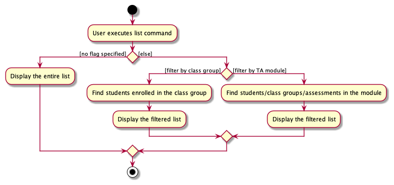

### \[Proposed\] Enrol Feature

#### Proposed Implementation

The proposed enrol mechanism is facilitated by `TAssist`. Its functionality, usage and behaviour is only for student entity. Additionally, it implements the following operations:

* `EnrolCommandParser#parse()` — Parses the command arguments.
* `EnrolCommand#execute()` — Executes `ModelManager#enrolStudent()` with given student(s) and class group.
* `ModelManager#enrolStudent()` — Enrols student(s) to a given class group.

Given below is an example usage scenario for the enrolment of a `Student` object to a `ClassGroup` object and how the enrol mechanism behaves at each step.

:information_source: **Assumption:** Valid `Student`, `Module` and `ClassGroup` objects are created beforehand.

Step 1. The user launches the application. The `TAssist` is already populated with data.

Step 2. The user executes `enrol` command to enrol student(s) to a `ClassGroup`. The `enrol` command also calls `EnrolCommandParser#parse()`, which parses the input and returns a successful/unsuccessful output message.
* An example of the `enrol` command: `enrol c/1 s/1,2,3,4,5,6`

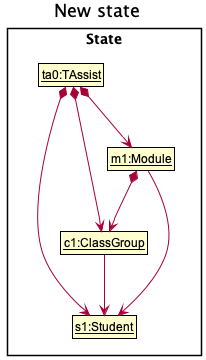

:information_source: **Note:**   1. Student(s) enrolled to a class group will automatically be linked to the module it belongs to.
  2. If a command fails its execution, it will not call `EnrolCommand#execute()`, instead a `CommandException` will be thrown and no student(s) will be enrolled to the given class group.

### \[Proposed\] Grading Assessment Feature

#### Proposed Implementation

The proposed grading assessment mechanism is facilitated by `TAssist`. Since there are various gradable components, a new entity `Assessment` will benefit the application. This entity will allow tutors to customize what are the different gradable components, from assignments to class participations. Tutors can add, delete and list this entity like the other entities. On top of that, they will be able to grade the assessment, using the `grade` command. The following operations will be implemented for the `grade` command:

* `GradeCommandParser#parse()` — Parses the command arguments.
* `GradeCommand#execute()` — Executes `ModelManager#gradeAssessment()` with the specified assessment, students and the grade they get.
* `ModelManager#gradeAssessment()` — Grades the students for the specified assessment.

The `Assessment` entity will be tied to a specific module. Hence, when a `TaModule` object is deleted, its associated `Assessment` objects are also deleted.

Given below is an example usage scenario of how the grading mechanism behaves at each step.

:information_source: **Assumption:** Valid `Student`, `Module`, `ClassGroup` and `Assessment` objects are created beforehand. `Student` objects are enrolled to the `ClassGroup` as well.

Step 1. The user launches the application. The `TAssist` is already populated with data.

Step 2. The user executes `grade a/1 s/1,2 g/1` command to grade the 1st assessment (`a1`) for the 1st and 2nd students enrolled in the module (`s1` and `s2` respectively) with grade 1 in the `TAssist`. the `grade` command would call the `GradeCommandParser#parse()`, which parses the input and return the assessment to grade, which students to grade and what is the grade the students will get for the assessment.

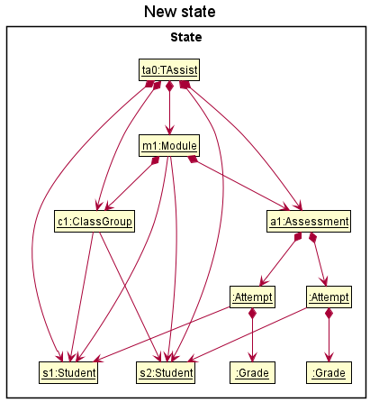

:information_source: **Note:** If a command fails its execution, it will not call `GradeCommand#execute()`, instead a `CommandException` will be thrown and no assessments will be graded.

The following sequence diagram shows how the grade operation works:

:information_source: **Note:** The lifeline for `GradeCommand` should end at the destroy marker (X) but due to a limitation of PlantUML, the lifeline reaches the end of diagram.

The following activity diagram summarizes what happens when a user executes a grade command:

#### Design considerations

**Aspect: How to grade assessments:**

* **Alternative 1 (current choice):** Create `Assessment` entity and this entity will contain the students attempts.
    * Pros: Easy to implement.
    * Cons: Duplicate data in storage, and need to ensure data is deleted properly if student/module is deleted.

* **Alternative 2:** Create `Assessment` entity and the `TaModule` entity will contain the student attempts.
    * Pros: All module related data are in one class.
    * Cons: Duplicate data in storage, hard to display assessments attempts.

### \[Proposed\] Mark/Unmark feature

#### Proposed Implementation

The proposed mark/unmark mechanism is facilitated by `TAssist`. Its functionality, usage and behaviour is currently exclusive to `StudentAttendance`. Additionally, it implements the following operations:

* `MarkCommandParser#parse()` — Parses the command arguments.
* `MarkCommand#execute()` — Executes `ModelManager#markAttendance()` or `ModelManager#unmarkAttendance` based on a specified class group index and week number.
* `ModelManager#markAttendance()` — Updates the specified `Lesson` object with a list of `StudentAttendance` objects.

Given below is an example usage scenario using `mark` which illustrates how the mechanism behaves at each step.

Step 1. The user launches the application. The `TAssist` is already populated with data.

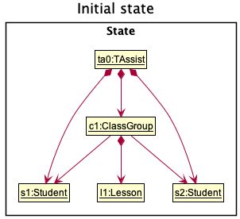

Step 2. The user executes `list class` command to list the class groups in the `TAssist`. The `list` command implementation is detailed below in the List Feature section.

Step 3. The user executes `list student c/1` command to list all the students in the class group with index 1.

Step 4. The user executes `mark attend c/1 w/1 s/1,2` to mark attendance for a lesson which belongs to a class group with index 1 and occurs in week 1. Students with indexes 1 and 2 are marked as having attended. The `mark` command also calls `MarkCommandParser#parse()`, which parses the input and returns a successful/unsuccessful message.

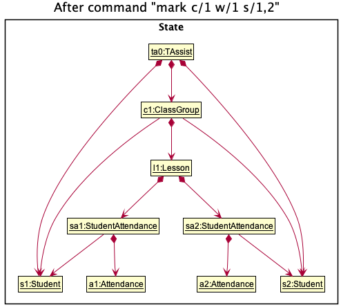

The following sequence diagram shows how the mark operation works:

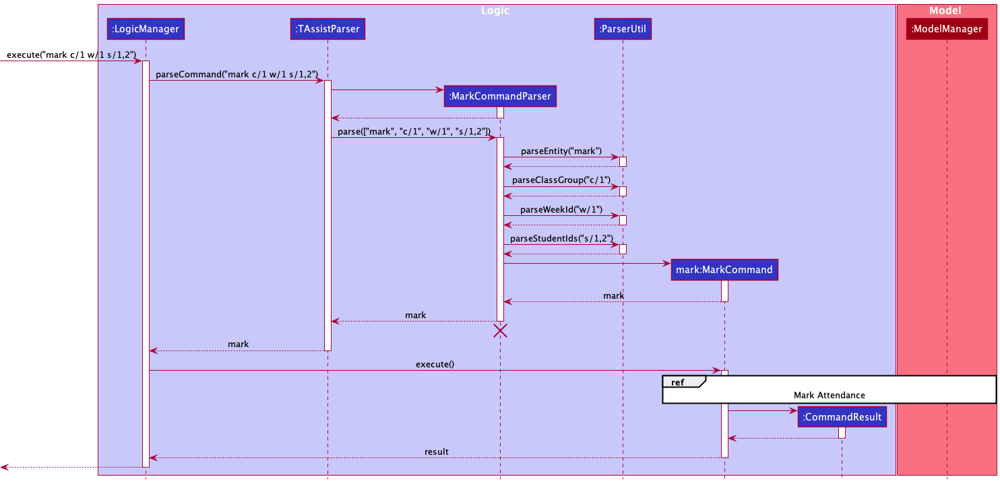

:information_source: **Note:** The lifeline for `MarkCommand` should end at the destroy marker (X) but due to a limitation of PlantUML, the lifeline reaches the end of diagram.

The following activity diagram summarizes what happens when a user executes a mark command:

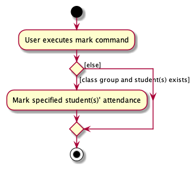

--------------------------------------------------------------------------------------------------------------------

## **Documentation, logging, testing, configuration, dev-ops**

* [Documentation guide](Documentation.md)
* [Testing guide](Testing.md)
* [Logging guide](Logging.md)
* [Configuration guide](Configuration.md)
* [DevOps guide](DevOps.md)

--------------------------------------------------------------------------------------------------------------------

## **Appendix: Requirements**

### Product scope

**Target user profile**:

* TA in charge of tutorial groups
* Needs to manage a significant number of student contacts
* Might be instructing multiple modules/tutorials
* Prefers desktop apps over other types
* Types fast
* Prefers typing to mouse interactions
* Is reasonably comfortable using CLI apps

**Value proposition**: TAssist creates a more conducive learning environment for educators and students by helping TAs consolidate students’ contacts and track their progress.

### TAssist User Stories

Priorities: High (must have) - `* * *`, Medium (nice to have) - `* *`, Low (unlikely to have) - `*`

<table class="c20">
    <tbody>
        <tr class="c11">
            <td class="c16" colspan="1" rowspan="1">
               No
            </td>
            <td class="c9" colspan="1" rowspan="1">
               As a …
            </td>
            <td class="c3" colspan="1" rowspan="1">
               I can…
            </td>
            <td class="c13" colspan="1" rowspan="1">
               So that I can…
            </td>
            <td class="c12" colspan="1" rowspan="1">
               Notes
            </td>
            <td class="c1" colspan="1" rowspan="1">
               Priority
            </td>
        </tr>
        <tr class="c11">
            <td class="c16" colspan="1" rowspan="1">
                
1

            </td>
            <td class="c9" colspan="1" rowspan="1">
                
TA

            </td>
            <td class="c3" colspan="1" rowspan="1">
                
[EPIC] Manage my students in my contacts

                

                <ol class="c10 lst-kix_ti3wjakiwqoc-0 start" start="1">
                    <li class="c7 li-bullet-0">Add students to my contacts</li>
                    <li class="c7 li-bullet-0">Remove students from my contacts</li>
                    <li class="c7 li-bullet-0">View students</li>
                </ol>
            </td>
            <td class="c13" colspan="1" rowspan="1">
                
keep in contact with them.

            </td>
            <td class="c12" colspan="1" rowspan="1">
                

            </td>
            <td class="c1" colspan="1" rowspan="1">
                
***

            </td>
        </tr>
        <tr class="c11">
            <td class="c16" colspan="1" rowspan="1">
                
2

            </td>
            <td class="c9" colspan="1" rowspan="1">
                
TA

            </td>
            <td class="c3" colspan="1" rowspan="1">
                
[EPIC] Manage the modules I am teaching

                <ol class="c10 lst-kix_rsnc1do3432k-0 start" start="1">
                    <li class="c7 li-bullet-0">add modules</li>
                    <li class="c7 li-bullet-0">remove modules</li>
                    <li class="c7 li-bullet-0">view modules</li>
                </ol>
            </td>
            <td class="c13" colspan="1" rowspan="1">
                
monitor the modules I am teaching this semester.

            </td>
            <td class="c12" colspan="1" rowspan="1">
                

            </td>
            <td class="c1" colspan="1" rowspan="1">
                
***

            </td>
        </tr>
        <tr class="c11">
            <td class="c16" colspan="1" rowspan="1">
                
3

            </td>
            <td class="c9" colspan="1" rowspan="1">
                
TA

            </td>
            <td class="c3" colspan="1" rowspan="1">
                
[EPIC] Manage the class groups I am teaching

                <ol class="c10 lst-kix_pn5b7fzij174-0 start" start="1">
                    <li class="c7 li-bullet-0">add class groups </li>
                    <li class="c7 li-bullet-0">remove class groups </li>
                    <li class="c7 li-bullet-0">view class groups </li>
                </ol>
            </td>
            <td class="c13" colspan="1" rowspan="1">
                
monitor the class groups I have to teach.

            </td>
            <td class="c12" colspan="1" rowspan="1">
                

            </td>
            <td class="c1" colspan="1" rowspan="1">
                
***

            </td>
        </tr>
        <tr class="c11">
            <td class="c16" colspan="1" rowspan="1">
                
4

            </td>
            <td class="c9" colspan="1" rowspan="1">
                
TA

            </td>
            <td class="c3" colspan="1" rowspan="1">
                
[EPIC] Manage students in the modules I am teaching

                <ol class="c10 lst-kix_l5c5afd4kfve-0 start" start="1">
                    <li class="c7 li-bullet-0">add students to a module</li>
                    <li class="c7 li-bullet-0">remove students from a module</li>
                    <li class="c7 li-bullet-0">view students in a module</li>
                </ol>
            </td>
            <td class="c13" colspan="1" rowspan="1">
                
easily monitor the students I am teaching in a module.

            </td>
            <td class="c12" colspan="1" rowspan="1">
                

            </td>
            <td class="c1" colspan="1" rowspan="1">
                
***

            </td>
        </tr>
        <tr class="c11">
            <td class="c16" colspan="1" rowspan="1">
                
5

            </td>
            <td class="c9" colspan="1" rowspan="1">
                
TA

            </td>
            <td class="c3" colspan="1" rowspan="1">
                
Add class groups to a module

            </td>
            <td class="c13" colspan="1" rowspan="1">
                
track which module a class groups belongs to.

            </td>
            <td class="c12" colspan="1" rowspan="1">
                

            </td>
            <td class="c1" colspan="1" rowspan="1">
                
***

            </td>
        </tr>
        <tr class="c11">
            <td class="c16" colspan="1" rowspan="1">
                
6

            </td>
            <td class="c9" colspan="1" rowspan="1">
                
TA

            </td>
            <td class="c3" colspan="1" rowspan="1">
                
keep track of students’ attendance

                
Conditions:

                <ol class="c10 lst-kix_8pu3ok8lb4xj-0 start" start="1">
                    <li class="c7 li-bullet-0">add student to a lesson</li>
                    <li class="c7 li-bullet-0">remove student from a lesson </li>
                    <li class="c7 li-bullet-0">view students in a lesson</li>
                    <li class="c7 li-bullet-0">Total attendance count</li>
                </ol>
            </td>
            <td class="c13" colspan="1" rowspan="1">
                
focus on students who have not been attending lessons.

            </td>
            <td class="c12" colspan="1" rowspan="1">
                

            </td>
            <td class="c1" colspan="1" rowspan="1">
                
***

            </td>
        </tr>
    </tbody>
</table>

### Use cases

(For all use cases below, the **System** is the `TAssist` and the **Actor** is the `TA`, unless specified otherwise)

**Use case 01: Add a module**

**MSS**

1.  TA requests to add a new module with the specified details.
2.  TAssist adds the new module and displays its details.

    Use case ends.

**Extensions**

* 1a. TAssist detects an error in the entered command.

    * 1a1. TAssist prompts for the correct command.

    * 1a2. TA enters a new command.

      Steps 1a1-1a2 are repeated until the command entered is correct.

      Use case resumes from step 2.

**Use case 02: List modules**

**MSS**

1.  TA requests to list modules.
2.  TAssists displays the details of all modules.

    Use case ends.

**Extensions**

* 1a. TAssist detects an error in the entered command.

    * 1a1. TAssist prompts for the correct command.

    * 1a2. TA enters a new command.

      Steps 1a1-1a2 are repeated until the command entered is correct.

      Use case resumes from step 2.

**Use case 03: Delete a module**

**MSS**

1. TA requests to <ins>list modules (UC02)</ins>.
2. TA requests to delete a specific module in the list.
3. TAssist deletes the module and the class groups associated with it.

    Use case ends.

**Extensions**

* 2a. The list is empty.

  Use case ends.

* 2b. TAssist detects an error in the entered command.

    * 2b1. TAssist prompts for the correct command.

    * 2b2. TA enters a new command.

      Steps 2b1-2b2 are repeated until the command entered is correct.

      Use case resumes from step 3.

**Use case 04: Add a class group**

**Preconditions: The module that the class group will be added to already exists.**

**MSS**

1. TA requests to <ins>list modules (UC02)</ins>.
2. TA requests to add a new class group with the specified details.
3. TAssist adds the new class group and displays its details.

    Use case ends.

**Extensions**

* 2a. TAssist detects an error in the entered command.

    * 2a1. TAssist prompts for the correct command.

    * 2a2. TA enters a new command.

      Steps 1a1-1a2 are repeated until the command entered is correct.

      Use case resumes from step 2.

**Use case 05: List class groups**

**MSS**

1.  TA requests to list class groups.
2.  TAssist displays the details of all class groups.

    Use case ends.

**Extensions**

* 1a. TAssist detects an error in the entered command.

    * 1a1. TAssist prompts for the correct command.

    * 1a2. TA enters a new command.

      Steps 1a1-1a2 are repeated until the command entered is correct.

      Use case resumes from step 2.

**Use case 06: Delete a class group**

**MSS**

1.  TA requests to <ins>list class groups (UC05)</ins>.
2.  TA requests to delete a specific class group in the list.
3.  TAssist deletes the class group.

    Use case ends.

**Extensions**

* 2a. The list is empty.

  Use case ends.

* 2b. TAssist detects an error in the entered command.

    * 2b1. TAssist prompts for the correct command.

    * 2b2. TA enters a new command.

      Steps 2b1-2b2 are repeated until the command entered is correct.

      Use case resumes from step 3.

**Use case 07: Add a student**

**MSS**

1.  TA requests to add a new student with the specified details.
2.  TAssist adds the new student and displays their details.

    Use case ends.

**Extensions**

* 1a. TAssist detects an error in the entered command.

    * 1a1. TAssist prompts for the correct command.

    * 1a2. TA enters a new command.

      Steps 1a1-1a2 are repeated until the command entered is correct.

      Use case resumes from step 2.

**Use case 08: List students**

**MSS**

1.  TA requests to list students.
2.  TAssist displays the details of all students.

    Use case ends.

**Extensions**

* 1a. TAssist detects an error in the entered command.

    * 1a1. TAssist prompts for the correct command.

    * 1a2. TA enters a new command.

      Steps 1a1-1a2 are repeated until the command entered is correct.

      Use case resumes from step 2.

**Use case 09: Delete a student**

**MSS**

1.  TA requests to <ins>list students (UC08)</ins>.
2.  TA requests to delete a specific student in the list.
3.  TAssist deletes the student.

    Use case ends.

**Extensions**

* 2a. The list is empty.

  Use case ends.

* 2b. TAssist detects an error in the entered command.

    * 2b1. TAssist prompts for the correct command.

    * 2b2. TA enters a new command.

      Steps 2b1-2b2 are repeated until the command entered is correct.

      Use case resumes from step 3.

### Non-Functional Requirements

1.  Should work on any _mainstream OS_ as long as it has Java `11` or above installed.
2.  Should be able to hold up to 1000 entities without a noticeable sluggishness in performance for typical usage.
3.  A user with above average typing speed for regular English text (i.e. not code, not system admin commands) should be able to accomplish most of the tasks faster using commands than using the mouse.
4.  Should not depend on external/remote servers.
5.  Should not depend on a Database Management System (DBMS).

### Glossary

* **Class Group**: The different types of classes a module has. E.g. T01, T02, B01, B02
* **CLI**: Command line interface
* **Entity**: A generic object used in TAssist, which can be an instance of Assessment, ClassGroup, Module, or Student
* **GUI**: Graphical user interface
* **Lesson**: The weekly lesson that students turn up for
* **Mainstream OS**: Windows, Linux, Unix, OS-X
* **Module**: A NUS SoC module
* **MSS**: Main Success Scenario
* **NUS**: The National University of Singapore
* **Student**: A student in NUS
* **TA**: A Teaching Assistant in NUS SoC
* **TaModule**: Represents a Module. Named differently due to conflict with Java class.

--------------------------------------------------------------------------------------------------------------------

## **Appendix: Instructions for manual testing**

Given below are instructions to test the app manually.

:information_source: **Note:** These instructions only provide a starting point for testers to work on;
testers are expected to do more *exploratory* testing.

### Launch and shutdown

1. Initial launch

   1. Download the jar file and copy into an empty folder

   1. Double-click the jar file Expected: Shows the GUI with a set of sample contacts. The window size may not be optimum.

1. Saving window preferences

   1. Resize the window to an optimum size. Move the window to a different location. Close the window.

   1. Re-launch the app by double-clicking the jar file. 
       Expected: The most recent window size and location is retained.

1. _{ more test cases …​ }_

### Deleting a student

1. Deleting a student while all students are being shown

   1. Prerequisites: List all students using the `list` command. Multiple students in the list.

   1. Test case: `delete student 1` 
      Expected: First contact is deleted from the list. Details of the deleted contact shown in the status message. Timestamp in the status bar is updated.

   1. Test case: `delete student 0` 
      Expected: No student is deleted. Error details shown in the status message. Status bar remains the same.

   1. Other incorrect delete commands to try: `delete`, `delete student x`, `...` (where x is larger than the list size) 
      Expected: Similar to previous.

1. _{ more test cases …​ }_

### Saving data

1. Dealing with missing/corrupted data files

   1. _{explain how to simulate a missing/corrupted file, and the expected behavior}_

1. _{ more test cases …​ }_
